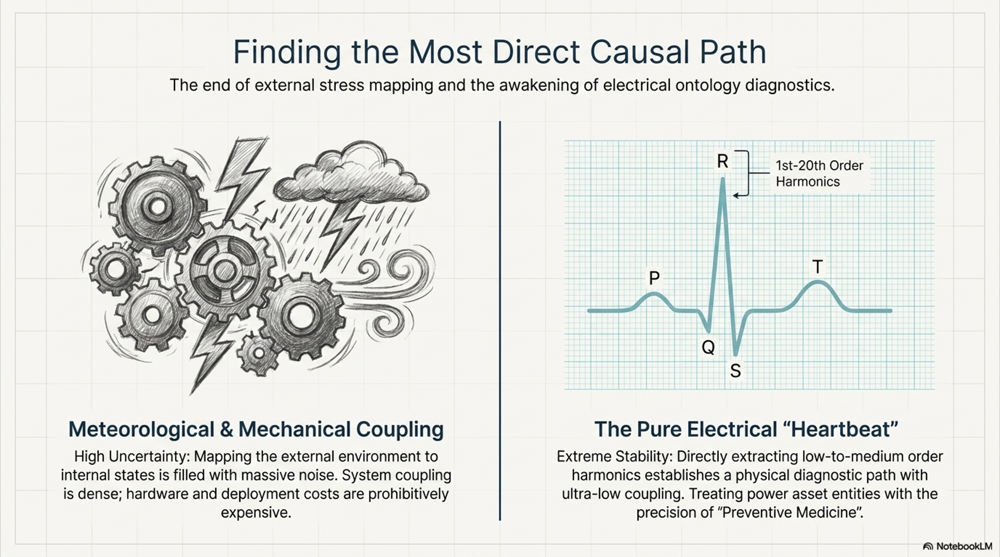
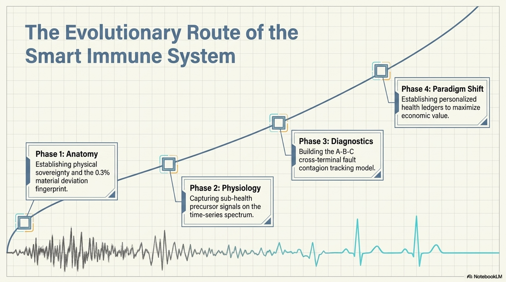
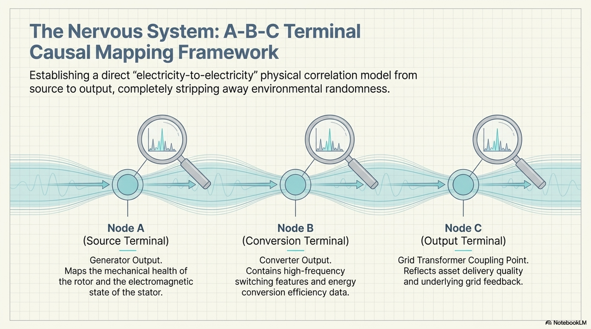
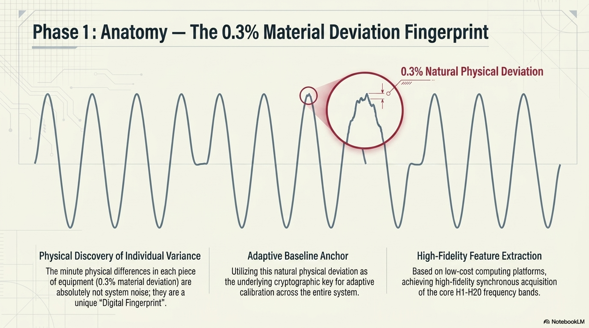
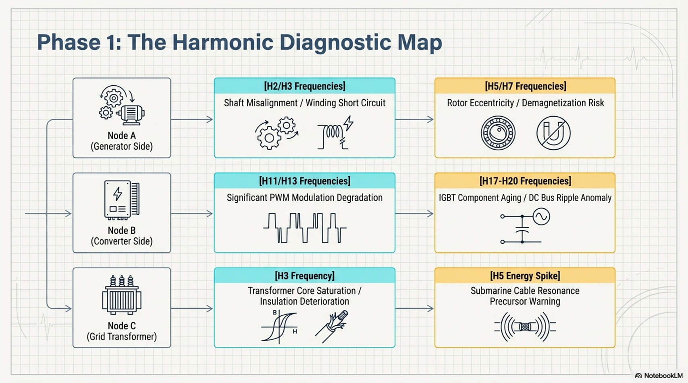
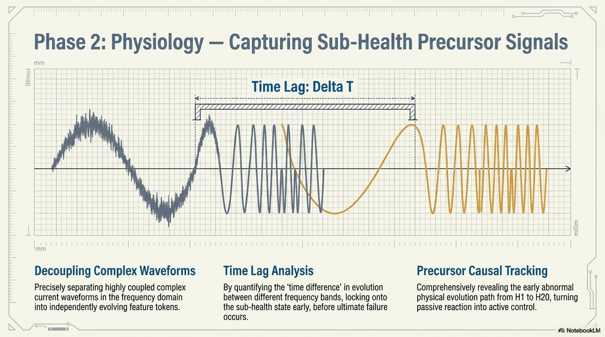
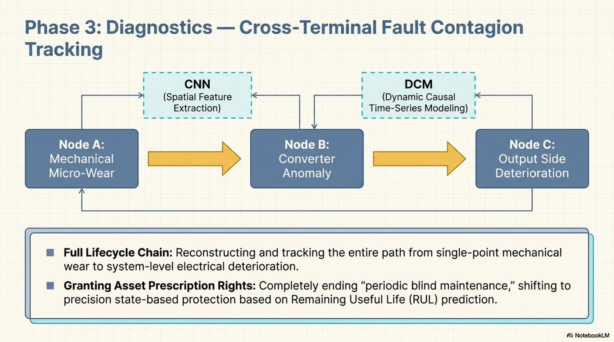
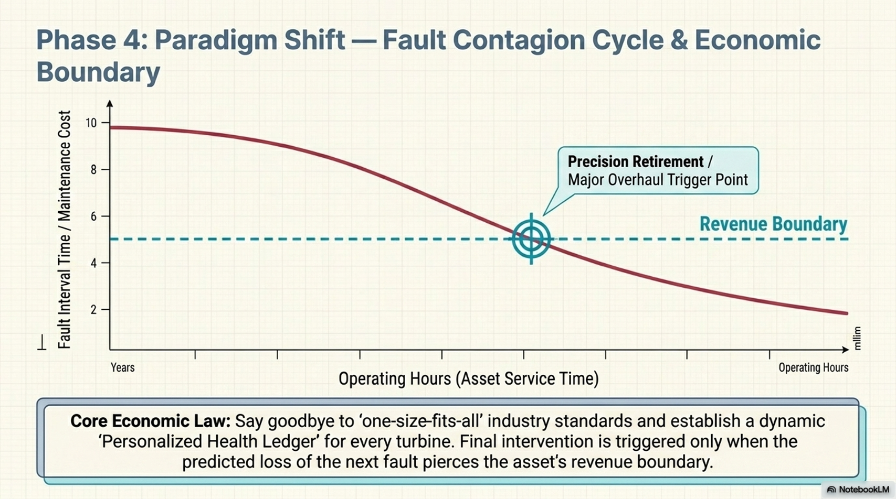
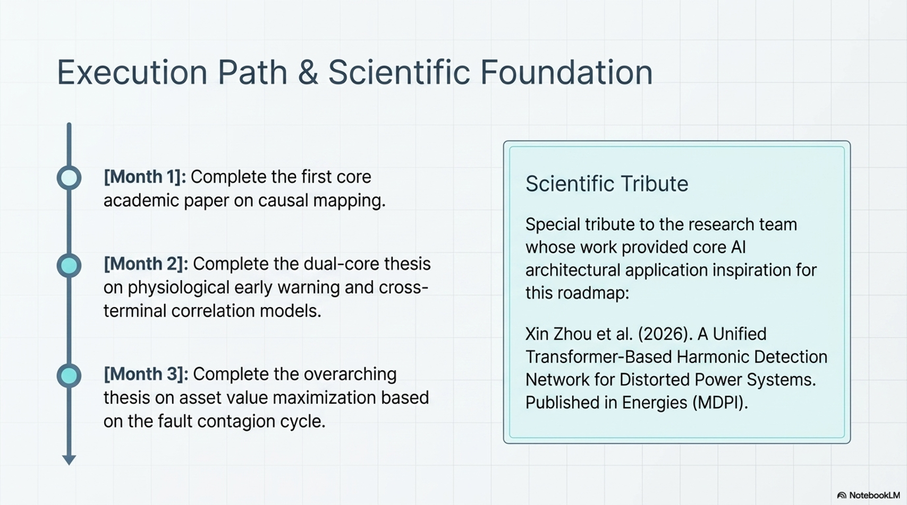

# 🚀 Technical Roadmap for Intelligent Power Asset Monitoring
## A "Source-based Prevention" Scheme via Mid-to-Low Order Harmonic Fingerprinting

---

### 📌 Quick Navigation
[Motivation](#-motivation) | [Core Vision](#i-core-vision) | [Phase 1: Anatomy](#ii-phase-1-anatomy--establishing-physical-sovereignty) | [Phase 2: Physiology](#iii-phase-2-physiology--capturing-precursor-signals) | [Phase 3: Diagnostics](#iv-phase-3-diagnostics--cross-terminal-fault-contagion-tracking) | [Phase 4: Paradigm Shift](#v-phase-4-paradigm-shift--individualized-management--value-maximization) | [Milestones](#vi-milestones)

---

### 📢 Update Log

- **[2026-05-13] Paper 1 Published:** We have officially released our first preprint paper under the Phase 1 Anatomy framework.
  - **Title:** *A Causal Auditing Paradigm for Sub-health Diagnosis of Offshore Wind Assets via Multi-terminal Harmonic Fingerprinting*
  - **Abstract:** This paper establishes the "Electromagnetic Ledger" system. By executing a real-time audit of the 1st-20th order harmonic fingerprints across generators, converters, switchgears, and collector cables, it enables a paradigm shift from traditional "stochastic state prediction" to "deterministic causal auditing" ($\Delta = Physical\ Reality - Causal\ Expectation$).
  - **DOI:** 
  - **Directory:** [`papers/paper-1-causal-mapping`](./papers/paper-1-causal-mapping)
  - **PDF:** [Read the Full Paper Here](./papers/paper-1-causal-mapping/A%20Causal%20Auditing%20Paradigm%20for%20Sub-health%20Diagnosis%20of%20Offshore%20Wind%20Assets%20via%20Multi-terminal%20Harmonic%20Fingerprinting.pdf)

---

### 📝 Motivation

**Inspired by the 2026 research of Xin Zhou et al. on Transformer-based harmonic detection:**
While predicting transformer health based on external variables like wind speed is a promising direction, the stochastic nature of wind (directionality, turbulence) and the complexity of blade-force interaction introduce excessive uncertainty. These "external-to-internal" mapping models often suffer from broken physical causal chains.

  
  
<i>Fig 1: From External Stochastic Prediction to Internal Causal Auditing</i>

I aim to bridge this gap by establishing a **direct electrical causal audit**: bypassing the uncertainty of mechanical force analysis and reading the system's internal state directly through **RMS and 1-20th order harmonics** across A, B, and C terminals. This transforms asset management from unreliable environmental prediction into a precise, internal "Physiological Audit," enabling the early capture of latent faults with deterministic accuracy.

  
  
<i>Fig 2: The Evolutionary Route of the Smart Immune System</i>

---

### I. Core Vision

**The Paradigm Shift from "End-of-line Alarm" to "Source-based Prevention"**
We are pivoting from expensive and hard-to-deploy Partial Discharge (PD) monitoring to **fine-grained acquisition of harmonics below the 20th order**. By elevating power maintenance to the level of "Preventive Medicine," we utilize the A-B-C terminal physical causality to build a scene-neutral "Intelligent Immune System" for power assets.

*   **Minimalist Hardware, Powerful Performance**: For harmonics under 20th order, a minimum of **40 samples per cycle** is sufficient for precision reconstruction. Based on application experience, STM32F4 series (and above) microcontrollers can easily handle 4-channel, 256-point real-time current acquisition, significantly reducing hardware costs for large-scale deployment.
*   **Software-Defined Safety**: By drastically reducing hardware deployment costs, the technical core shifts from "Precision Sensors" to **Edge Computing** and **Platform Intelligence**. Low-cost deployment grants the "Right of Diagnosis" across the entire network.
*   **Legacy Integration**: Many power assets (e.g., wind turbines) already have robust current acquisition systems. We can directly leverage existing sensors for data collection, requiring zero additional hardware cost.

  
  
<i>Fig 3: A-B-C Terminal Causal Mapping Framework</i>

---

### II. Phase 1: Anatomy — Establishing Physical Sovereignty
> **Objective**: Establish the causal mapping of current features across A-B-C terminals through mathematical and physical derivation.

*   **Node Definitions**:
    *   **Node A (Source)**: Generator output. Directly maps rotor mechanical health and stator electromagnetic status.
    *   **Node B (Transformation)**: Converter output. Contains high-frequency switching features and conversion efficiency data.
    *   **Node C (Output)**: Grid-side transformer coupling point. Reflects asset delivery quality and grid feedback.
*   **Core Logic**: Establishing a direct **"Electric-to-Electric"** physical correlation model between Node A and Node C to eliminate environmental stochasticity.
*   **Key Discovery**: Identifying the **0.3% Material Bias (Individual Variability)**. Tiny physical differences inherent in each unit act as a unique "Digital Fingerprint," serving as the key for self-adaptive calibration.
    > **Technical Note**: The 0.3% figure represents the intrinsic manufacturing tolerance limits of high-precision power equipment (e.g., flux density variance in permanent magnets, air-gap eccentricity). This stable "intrinsic bias" serves as a unique Physical Fingerprint for each asset.

  
  
<i>Fig 4: The 0.3% Material Deviation Fingerprint — The Digital Twin Anchor</i>

*   **Technical Stack**: Synchronous acquisition based on low-cost STM32F4/ESP32 platforms for fine-grained H1-H20 feature extraction.
*   **Harmonic-Fault Dictionary (A-B-C Matrix)**:
    *   **Node A (Generator)**: Utilizing H2/H3 for shaft misalignment/winding shorts; H5/H7 for eccentricity/demagnetization risks.
    *   **Node B (Converter)**: Utilizing H11/H13 for PWM modulation quality; H17-H20 for IGBT aging and DC-link ripple.
    *   **Node C (Transformer)**: Utilizing H3 for core saturation/insulation health; H5 energy spikes for subsea cable resonance early warning.

  
  
<i>Fig 5: The Harmonic Diagnostic Map — Cross-Terminal Physical Mapping</i>

*   **Deliverable**: Research paper on the causal relationship and fault mapping of current harmonics from Terminal A to C.

---

### III. Phase 2: Physiology — Capturing Precursor Signals
> **Objective**: Deconstruct the temporal evolution of H1-H20 features to identify "sub-health" fingerprints across nodes A, B, and C.

- **Core Logic**: Correlating decoupled harmonic feature tokens across A-B-C terminals. Analyzing the **Time Lag** between internal electrical shifts at different nodes.
- **Key Discovery**: Identifying the predictive causal chain from source (Node A) to output (Node C) using H1-H20 precursor signals, effectively bypassing environmental noise.

  
  
<i>Fig 6: Physiology — Capturing Sub-Health Precursor Signals & Time-Lag Analysis</i>

- **Deliverable**: Research paper on the time-series evolution of harmonic fingerprints and the identification of precursor signals.

---

### IV. Phase 3: Diagnostics — Cross-Terminal Fault Contagion Tracking
> **Objective**: Build a fault evolution matrix for A-B-C terminals using CNN and Dynamic Causal Models (DCM) to grant assets a "Prescriptive Right."

- **Core Logic (Correlation Modeling)**:
    - **Multi-Terminal Internal Prediction**: Linking electrical fingerprints (RMS, H1-H20) across A, B, and C nodes to predict fault evolution.
    - **Cross-Terminal Correlation**: Analyzing how internal electromagnetic anomalies at Node A propagate through Node B to Node C.
    - **Temporal Evolution**: Tracking the "infection" path of harmonic features on the timeline; identifying how symptoms at Node C feedback to risks at Nodes B and A.

  
  
<i>Fig 7: Diagnostics — Cross-Terminal Fault Contagion Tracking Model</i>

- **Implementation (Life-Cycle Optimization)**:
    - **Dynamic Early Warning**: Providing real-time prescriptive commands based on 20th-order harmonic data.
    - **Maintenance Optimization**: Iterative model refinement to accurately predict Residual Useful Life (RUL). Transitioning from "Scheduled Maintenance" to "State-based Protection," drastically optimizing maintenance cycles.
- **Deliverable**: Research paper on cross-device fault correlation models and decision frameworks for power asset life-cycle optimization.

---

### V. Phase 4: Paradigm Shift — Individualized Management & Value Maximization
> **Objective**: Break the monopoly of "Uniform Standards" and establish "Individualized Health Ledgers" as the new industry standard.

- **Core Argument (Individualized Asset Ledger)**:
    - **Against "One-size-fits-all"**: Assets are individuals. Based on the 0.3% initial fingerprint (Phase 1), a dynamic ledger is created for every single wind turbine, moving away from crude threshold-based replacements.
    - **Monitoring "Fault Contagion"**: Utilizing CNN models to track fault progression curves. Focusing on the **"Fault Contagion Cycle"**—when the time between faults significantly shortens, the asset is deemed to be at the end of its life.
- **Competitive Advantage (Economic Maximization)**:
    - **Extracting Full Value**: Under model supervision, maximize the residual value of every asset. Strategic overhaul or decommissioning is only triggered when the economic loss of the "next fault" exceeds the asset's revenue boundary.
    - **Precision Investment**: Transforming traditional maintenance spending into data-driven "Precision Economic Input," ensuring every dollar is invested where it generates the most value.

  
  
<i>Fig 8: Paradigm Shift — Fault Contagion Cycle & Economic Boundary</i>

- **Deliverable**: Research paper on asset value maximization strategies and industry paradigm shifts based on dynamic fault contagion models.

---

### VI. Milestones

- [ ] **M1 (Within 1 Month)**: Complete the first paper.
- [ ] **M2 (Within 1 Month)**: Complete the second and third paper.
- [ ] **M3 (Within 1 Month)**: Complete the fourth paper.

  
  
<i>Fig 9: Execution Path & Scientific Foundation Tribute</i>

---

### 🙏 Special Thanks

This roadmap's conceptual inspiration stems from the following academic work. I pay tribute to the author team for their exploration in the field of AI applications for power systems:

*   **Title**: *A Unified Transformer-Based Harmonic Detection Network for Distorted Power Systems*
*   **Authors**: Xin Zhou, Qiaoling Chen, Li Zhang, Qianggang Wang, Niancheng Zhou, Junzhen Peng, and Yongshuai Zhao.
*   **Journal**: *Energies* (MDPI), 2026.
*   **DOI/Link**: [https://doi.org/10.3390/en19030650](https://doi.org/10.3390/en19030650)

---

> **Clark Quotes**:  
> *“I have obtained the key to Babel, and I shall raise countless towers in Shinar.”*
