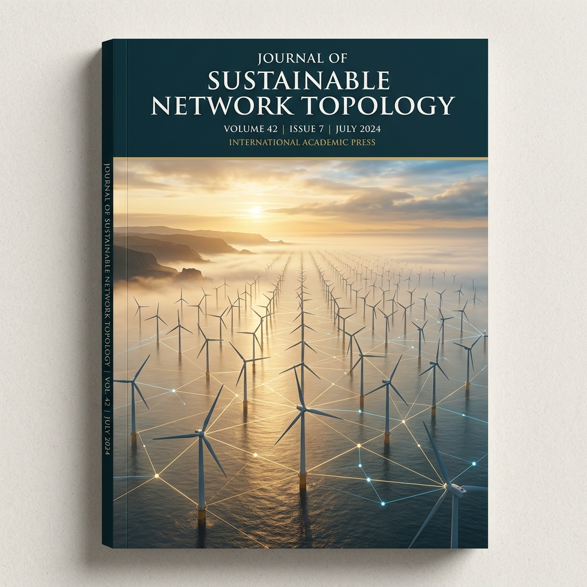
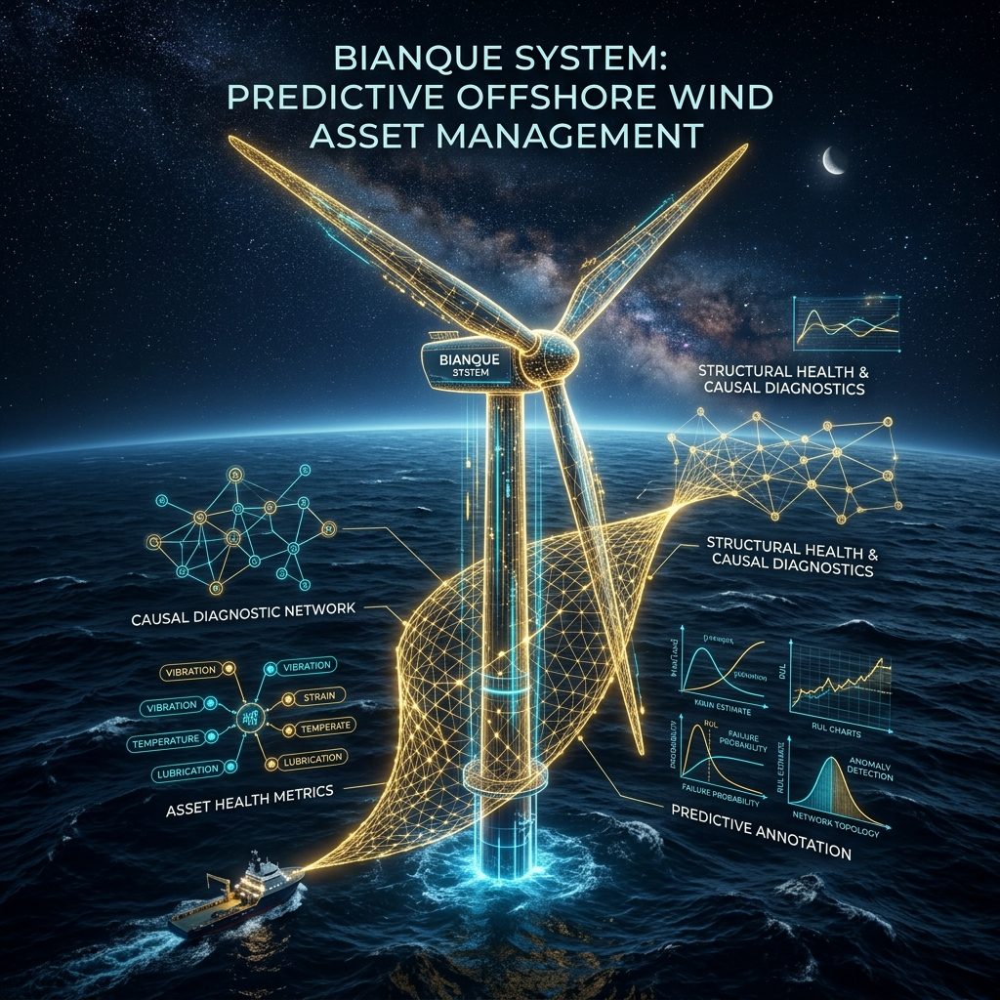
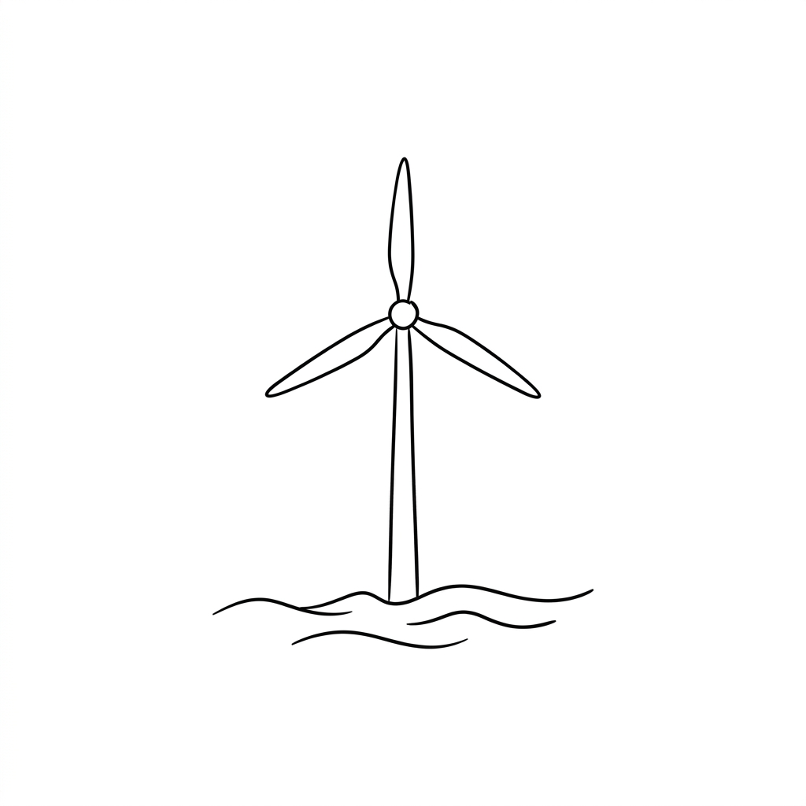
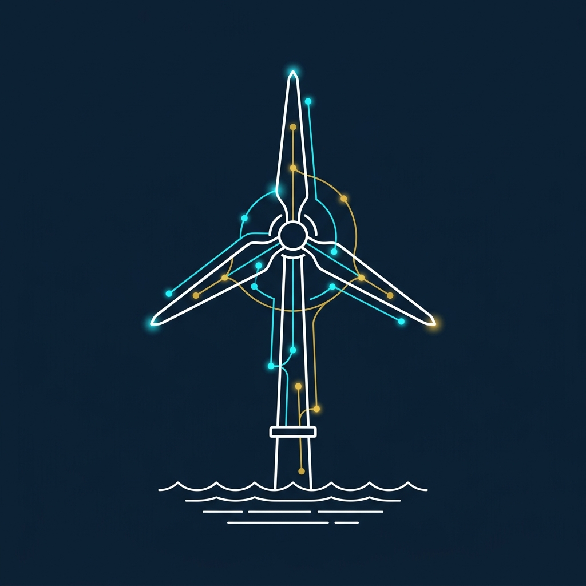
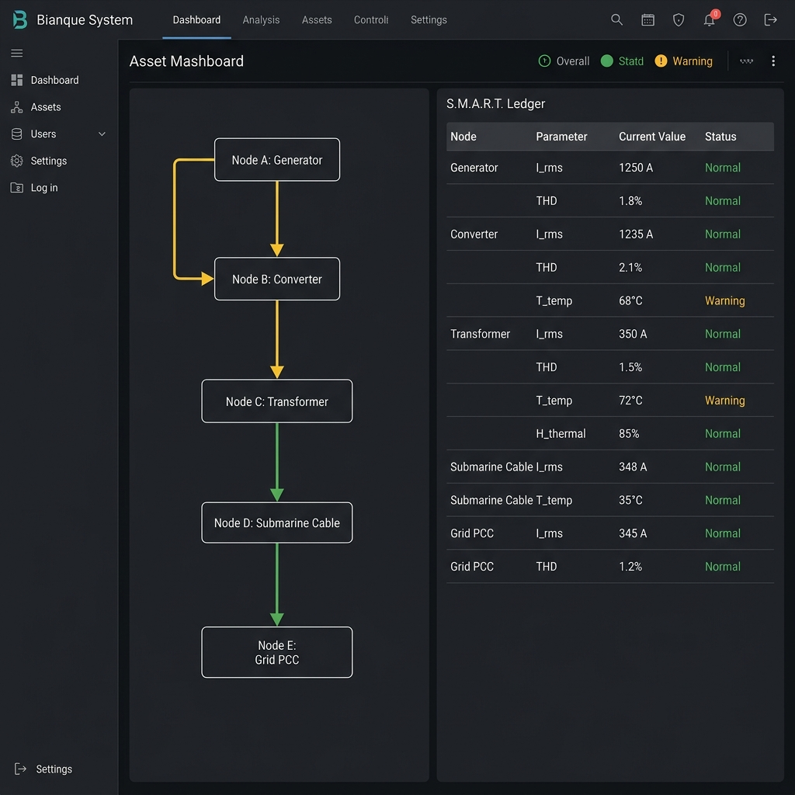

# Bianque System Paper Cover & Layout Assets

This directory contains the customized design assets created for the **Bianque System** paper:
*"Bianque System: Predictive Offshore Wind Asset Management and Value Maximization under Causal Contagion"*.

---

## 📊 Option 1: Sunny Skies & Real Simulation Figures (蓝天白云·真实仿真图表封面)
*Best suited for: Presentation slides, report covers, or home page banners. Features a wind turbine under sunny blue skies with simple wave lines. Floating around it are actual, high-resolution screenshots of the simulation figures from your paper (including Fig. 5 hysteresis loops, Fig. 8 weights, Fig. 10 stopping boundaries, and Fig. 14 Nyquist stability loops), rendered cleanly with light borders.*

---

## 🌅 Option 2: Epic Dawn Matte Painting (宏大叙事·晨曦迷雾风封面)
*Best suited for: Professional academic journals (e.g. Nature/Science cover style) or key slides. Captures the grand scale of offshore wind farms at sunrise with subtle gold/blue data networks.*

---

## 🚀 Option 3: Futuristic Sci-Fi Cover (未来科技感炫酷封面 - 原版)
*Best suited for: Presentation title slides, high-impact poster prints, or online promotional materials. Features a wind turbine at night under a starry sky, wrapped in glowing golden and cyan diagnostic networks.*

---

## 🎨 Option 4: Minimalist Hand-Drawn Sketch (极简简笔画风封面)
*Best suited for: Minimalist, clean, hand-drawn sketch style covers. Simple black outline on a white background.*

---

## 🎨 Option 5: Minimalist Line-Art Cover (极简蓝底线框风封面)
*Best suited for: Professional reports, official book covers, or formal preprints (e.g. Nature/IEEE style).*

---

## 💻 Option 6: Software Dashboard Screenshot (系统控制台截图风)
*Best suited for: Inline paper figures (e.g. System Implementation sections) or software demonstration diagrams.*

---

## 🔍 Asset Details & Node Parameters

All designs conform strictly to the mathematical parameters and topology defined in the paper:
* **Nodes A–E**: Generator, Converter, Box Transformer, Submarine Cable, Grid PCC.
* **S.M.A.R.T. Ledger Parameters**: $T_{run}$, $I_{rms}$, $THD$, $H_{thermal}$, $\Delta T$.
