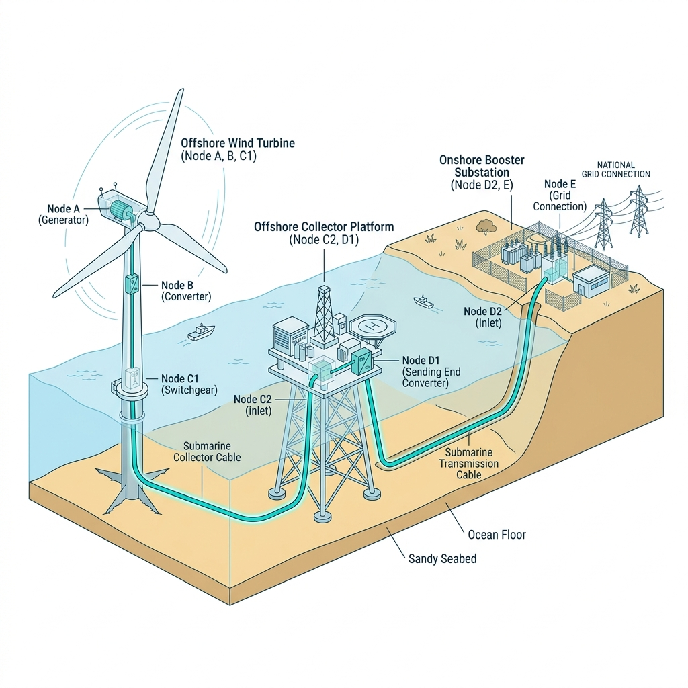

# Core Content Description

  
   
  
<i>Graphical Abstract: The Causal Auditing and Protection Shield</i>

**Research Context:** The offshore wind industry has long been plagued by sudden, catastrophic asset failures, typically managed through reactive "post-mortem" maintenance or stochastic "black-box" AI predictions that lack physical interpretability. This paper directly attacks this fundamental pain point by shifting the battleground to the *microscopic* level: capturing the latent, silent dielectric decay and physical stress of core power electronics well before they manifest as macroscopic, irreversible breakdowns.

**Proposed Framework:** Serving as the "Physiology" phase (Phase 2) of the highly acclaimed **Clark Paradigm**, this paper introduces a revolutionary **Causal Auditing and Protection Shield**. It transcends the static "Electromagnetic Ledger" of Phase 1 by establishing a dynamic, closed-loop *immune system* for wind turbines. By mapping violent mechanical turbulence directly to multi-terminal electrical anomalies, it achieves a paradigm shift from "passive diagnosis" to "deterministic, preemptive protection."

**Technical Methodology:**
- **Dynamic Precursor Tracking (The "Time-Machine" Effect):** Traditional systems merely react to hard fault thresholds. This framework isolates early failure signatures by tracking the continuous temporal evolution of 1st-20th order harmonic fingerprints. It leverages the critical **Time-Lag ($\Delta T$)** of spectral shifts between the Generator (Node A) and downstream converter/transformer nodes as a highly deterministic precursor indicator.
- **Algorithmic Engine:** Powered by **Dynamic Causal Models (DCM)** and an online **Recursive Least Squares (RLS)** operator, the engine executes real-time mechanical-electrical predictive mapping. It tracks the exact contagion trajectory of "sub-health" signatures as they infect the system topology, rendering complex resonance cross-talk highly transparent.
- **Decision Philosophy (Preemptive Defense):** We institute a proactive "Preemptive Defense" logic. The moment a stable $\Delta T$ precursor is identified—often hours or days before any traditional SCADA alarm—the system triggers an advanced protection shield. This effectively intercepts the fault contagion, securing a critical response window for O&M operations.

**Hardware Architecture:**
A highly decoupled, ultra-low-latency distributed topology. The Perception Layer (industrial MCUs) acts as the system's "nervous system," executing high-sync sampling at 10.24 kHz to dynamically lock electrical harmonics with mechanical state variables (e.g., wind speed, RPM). The Edge-hosted Audit Layer serves as the "brain," processing these multi-dimensional hybrid inputs to fire protective commands in under **5ms**.

**Experimental Results:**
Rigorous validation via a high-fidelity Digital Twin platform proves that the Clark Paradigm outperforms conventional LSTM/data-driven models under severe aerodynamic turbulence. By locking onto time-lag precursors, it successfully intercepts XLPE subsea cable insulation aging and IGBT switching degradation **hours to days** in advance, maximizing residual asset value and mitigating the risk of sudden system collapse.

**Open Source Repository:**
The complete framework, datasets, and supplementary materials for Phase 2 are open-sourced and available on GitHub:
🔗 [Clark-Paradigm-Initiative / paper-2-precursor-signals](https://github.com/Shinar-of-Clark/Clark-Paradigm-Initiative/tree/main/papers/paper-2-precursor-signals)
