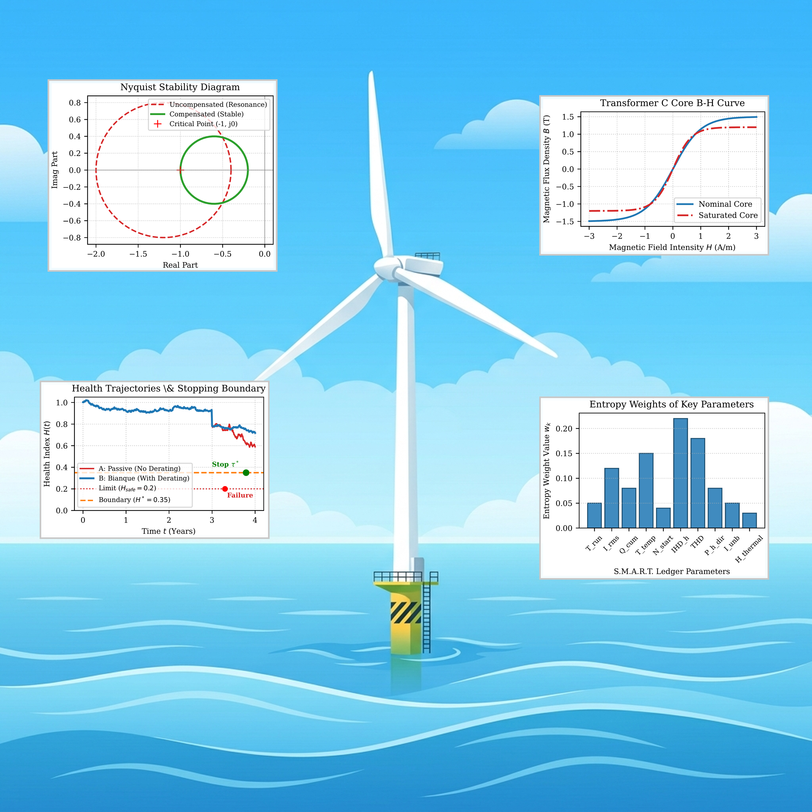

# Core Content Description

  
   
  
<i>Graphical Abstract: Bianque System: Predictive Management and Economic Value Maximization of Multi-Terminal Offshore Wind Assets Based on Causal Contagion (Phase 4)</i>

---

**Research Context:**
As offshore wind power evolves toward deep-sea and large-capacity wind farm clusters, localized "sub-health" states are no longer isolated events; rather, they propagate via physical coupling through complex grid topologies into field-wide chain reactions. This project (Phase 4 of the Clark Paradigm) directly confronts the challenge of **fault contagion** during asset operations—namely, the covert, networked dissemination of anomalies across multi-terminal assets. By shifting the perspective from traditional "single-device physical monitoring" to **"physics-to-economics" cross-scale causal mapping**, it aims to quantitatively decode the dynamic evolution of system-level economic benefits before asset value decay and catastrophic contagion occur.

**Proposed Framework:**
Serving as the concluding piece of the highly acclaimed **Clark Paradigm** (Phase 4, the "Value Maximization" stage), this paper formally proposes the **Bianque System** predictive asset management framework. Inspired by the preventive medicine philosophy of the legendary ancient Chinese physician Bianque ("treating the disease before it arises"), its core mission is not costly emergency repairs after complete asset destruction, but rather tracking and blocking multi-terminal fault contagion during the microscopic sub-health deviation stage, thereby extracting the maximum lifecycle capital returns. Based on **Optimal Stopping Theory**, the system tailors a dynamic **Dual Red Line Mechanism** for each device and topological line to solve for the optimal proactive shutdown and reset schedules.

**Technical Methodology:**
- **S.M.A.R.T. Ledger (Edge Collaborative Intelligent Data Engine):** Freeing itself from the constraints of expensive dedicated hardware, the system deploys lightweight databases at the edge to fully integrate SCADA and CMMS data streams. The ledger tracks multidimensional physical causal parameters in real time—including running time $T_{run}$, root-mean-square current $I_{rms}$, total harmonic distortion $THD$, cumulative thermal stress $H_{thermal}$, and transient propagation delay $\Delta T$—achieving low-cost, zero-retrofit asset perception.
- **Dynamic Bellman/PIDE Solving Engine:** The engine models the performance degradation of multi-terminal assets as a stochastic jump-diffusion process. Within the framework of optimal stopping theory, it constructs a Bellman state transition equation and employs the **Implicit Finite Difference Method** and **Howard Policy Iteration** to numerically solve the partial integro-differential equation (PIDE) with high precision, accurately tracking the convergence trajectory of the optimal shutdown threshold $H^*$ with respect to electricity tariff $C_{\text{tariff}}$ and failure cost $C_{\text{fail}}$.
- **Proactive Derating and Active Admittance Reconstruction Control:** For "sub-healthy" units running with minor anomalies, the physical degradation relationships among the proactive derating coefficient $\eta$, junction temperature $T_j$, and mechanical stress are quantitatively derived. By embedding a self-developed **admittance reconstruction compensation algorithm** into the grid-side inverter, the system stably extracts the remaining value under impedance parameter drifts without polluting the power grid.

**Hardware Architecture:**
A distributed edge computing topology based on the inverse deduction of high-frequency electromagnetic signatures. By utilizing existing standard current transformers (CT) and voltage transformers (PT) in the substation, high-frequency FFT calculations are performed on DSP chips to achieve synchronized monitoring at high sampling rates. Through an embedded "physical degradation mapping dictionary," the system allows generic terminals to inverse-infer non-visible physical processes—such as submarine cable water tree aging, main transformer magnetic saturation, and generator shaft micro-vibration—from the 1st to 50th order harmonic characteristics without installing additional sensors.

**Experimental Results:**
Rigorous simulations conducted on a high-fidelity Digital Twin platform demonstrate that, compared to traditional "run-to-failure passive replacement" or "fixed-interval preventive maintenance," the proactive derating and optimal stopping active reset decisions of the **Bianque System** successfully extend the safe operating life of wind turbine units while ensuring grid-connection stability. It increases the comprehensive expected salvage recovery ratio of assets, optimizes lifecycle investment returns, and achieves maximum extraction of the remaining economic value under extreme dynamic environments and multi-terminal fault contagion scenarios.

---

🔗 [Clark-Paradigm-Initiative / paper-4-asset-value-maximization](https://github.com/Shinar-of-Clark/Clark-Paradigm-Initiative/tree/main/papers/paper-4-asset-value-maximization)
